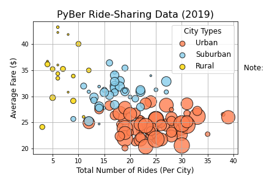
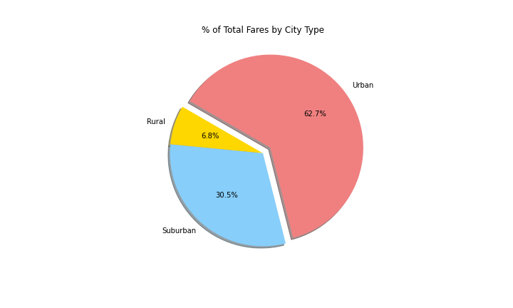

# PyBer Analysis

## Overview

For this project we were given a collection of information from the ride sharing app PyBer. We imported this data to Pandas to create a summary dataframe, and used Pandas and Matplotlib to perform analysis and visualization. We created multiple types of visualizations to get a get a better overall idea of what information the data conveys.

### Purpose

Every business needs reliable and accurate information in order to make the best and most well-informed decisions. Our purpose with this analysis is to summarize and visualize the differences between the use of PyBer in rural, suburban, and urban areas.

## Results

### Big Picture

>\
>This bubble chart shows the large difference in the way PyBer is used in different city types. 
>Note: Bubble size correlates with driver count per city

This chart shows that PyBer is utilized much more in uban and suburban areas than in rural areas. Additionally there are many more drivers per city in urban cities. The average fares in urban cities are lower than in suburban and rural cities, but as we will see later this is more than made up for by the total volume of rides. 

>\

Looking at the total fare amounts over time it is easy to see that they are fairly consistent over time.

### City Type Differences
<!--Ride sharing data includes the total rides, total drivers, total fares, average fare per ride and driver, and total fare by city type--!>

### Total Ride Count 

>\

Plotting the total number of rides per city, and grouping them by type shows just how much more PyBer is utilized in urban cities than in rural cities. There is only one outlier, and that is one of the urban cities that had an exceptionally high number of rides. 

>\

This pie chart shows the differences even more, with the urban cities have almost seventy percent of the total rides on PyBer. Suburban cities have a minor but still large portion at about twenty five percent.

### Ride Fare Differences

>\

The average fare amount per city doesn't differ as much between city types, but is lower in urban cities than in suburban and rural ones. The median fare is higher in rural cities than in suburban cities, but the fares are more variable in the rural cities. 

>\

In this pie chart the urban cities again make up the largest percentage. However, the difference is not as large as in the pie chart for total ride count. The higher average fares for the suburban and rural cities is the cause of this difference. 

### Number of Drivers

>\

This box and whisker plot shows just how many more drivers the urban cities have than the suburban and rural ones. Additionally, while the number of drivers doesn't vary much in the subarban and rural cities, the urban cities have as few as 3 and as many as 73 drivers. 

>\

The huge differences between the number of drivers in urban areas compared to suburban and rural ones is emphasized in this pie chart. With more than four-fifths of the total number of drivers, urban cities could possibly be oversaturated with drivers.

## Summary
<!--Three business recommendations to the CEO for addressing any disparities among the city types--!>

Given the lower average fares and high number of drivers in urban cities I would recommend coming up with a way to incentivise drivers to go to those suburban and rural cities. 

Since the urban cities have lower average fares and such a large percentage of total rides, any increase in fare price will have a dramatic affect on total fares collected. Bringing the average fare price of the urban areas in line with those of suburban and rural cities could be a good idea for the company.

The low number of rides and drivers in rural areas is slightly made up for by the higher average fares, but it is still an area that could use improvement. I recommend the company perform outreach to those communities to see if there's anything would get more people to use the PyBer ride-sharing service.
